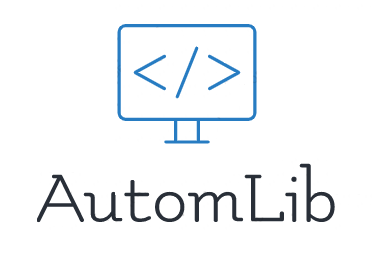

  

---

- **Autor:** Juan Esteban Cepeda Baena. Estudiante de Ciencias de la Computación y Administración de Empresas de la Universidad Nacional de Colombia.
- **Code License:** MIT
- **Email:** juancepeda.gestion@gmail.com / jecepedab@unal.edu.co
- **Google Site:** https://sites.google.com/view/juancepeda/
- **Linkedin:** https://www.linkedin.com/in/juan-e-cepeda-gestion/

---

La librería Autom consiste en un conjunto de algoritmos que permiten construir autómatas finitos y realizar operaciones con ellos, permitiendo computar todos los procesamientos de una cadena o listas de cadenas, así como sus características, y guardando la información dinámicamente en los archivos requeridos por el usuario.
